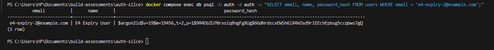
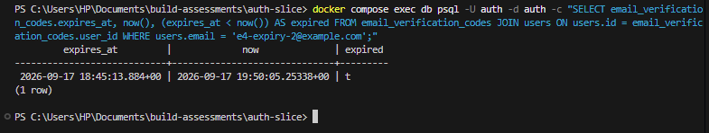

# Auth Slice — Documentation

## Section 1: What This Is

This is a complete authentication slice: a person can create an account, verify their email with a 6-digit code, sign in, recover a forgotten password, and land on a placeholder dashboard that shows only their name and a sign-out button. Underneath those five screens, every security-relevant decision is enforced on the server and backed by the database, not by the interface. Passwords are hashed with argon2id. Every sign-up, sign-in, password-reset and resend attempt is rate limited. Sessions are opaque tokens whose hash is stored server-side, so signing out actually deletes the session rather than just clearing a cookie. Verification codes and reset tokens expire against a timestamp column that the server checks on every request, not a countdown running in someone's browser. A double-submitted sign-up produces exactly one account, whether the duplicate arrives through a retried click or a raw duplicate request sent outside the browser entirely.

Deliberately not included: a landing or marketing page, any dashboard feature beyond the name and the sign-out button, profile editing, account settings, social sign-in, two-factor authentication, and an automated test suite. The first group is excluded because the brief for this assessment is a single flow, built properly, and every extra screen or feature is time spent on something that isn't being graded. The automated-test-suite exclusion is a genuine limitation rather than a scope choice: everything in this repository is verified with real `curl` and `psql` commands against the running application, recorded as evidence, rather than with a Jest or Playwright suite that could re-run those same checks automatically. Section 7 says more about what that costs.

## Section 2: How To Run It

**What to install:** Node.js (this project was built and run on v26.3.1; any Node 20.19+, 22.12+ or 24+ should work — Prisma 7.10's requirement; Next 16 needs ≥20.9), Docker Desktop, and `npm`.

1. Clone the repository and run `npm install`.
2. Copy `.env.example` to `.env`. Fill in `AUTH_SECRET` (required — generate one with `node -e "console.log(require('crypto').randomBytes(32).toString('base64url'))"`). `RESEND_API_KEY` and `EMAIL_FROM` are optional; leave `RESEND_API_KEY` empty and every email the app would send is printed to the server console instead.
3. Run `npm run db:up`. This starts a PostgreSQL 18 container on host port 5433, defined in `docker-compose.yml` under the Docker Compose project name `auth-slice`, chosen so it never collides with a database from another local project.
4. Run `npm run db:migrate`. This applies the schema (`prisma/migrations/20260916111844_init_auth/migration.sql`) and regenerates the Prisma Client.
5. Run `npm run dev`.
6. Open **http://localhost:3001**. The app is deliberately run on 3001, not Next.js's default 3000, because another local project already used 3000, and `APP_URL` in `.env` is fixed to match.

| Variable | Where its value comes from |
|---|---|
| `DATABASE_URL` | Fixed local value matching `docker-compose.yml`'s port mapping (`5433:5432`) and its `auth`/`auth`/`auth` user, password and database name. |
| `APP_URL` | Must match the port the app runs on (hardcoded to 3001 in `package.json`'s `dev`/`start` scripts). Used to build password-reset links and to validate the `Origin` header on writes. |
| `RESEND_API_KEY` | From resend.com's dashboard, under API Keys. Optional — if empty, emails print to the console instead of sending. |
| `EMAIL_FROM` | Any sender address you're allowed to send as. `onboarding@resend.dev` works without verifying a domain. |
| `AUTH_SECRET` | Generated locally with the command above. Never fetched from anywhere external. |
| `TRUST_PROXY` | Left empty for local development. Set to `"true"` only when deployed behind a proxy that itself sets `X-Forwarded-For` (see Section 5, Rate limiting). |

**Running a second copy of this project.** The Compose project name (`name: auth-slice`), the data volume (`auth-slice-pgdata`) and the host port (`5433`) are all fixed in `docker-compose.yml`. If another copy of this project is already running on the machine, `npm run db:up` in the second copy does not create a fresh database: Compose sees the same project name and reuses the existing container and volume, so both copies share one database and each one's users, sessions and rate-limit rows appear in the other. The simplest fix is to stop the other copy first with `npm run db:down` in that copy (never with `-v`, which deletes its data). To run both at once, give the second copy its own identity instead: change the `name:` under `volumes`, the host port in `5433:5432`, and the port in `DATABASE_URL`, and set `COMPOSE_PROJECT_NAME` (or change the top-level `name:`). Changing the project name alone is not enough, because the volume's name is hardcoded and would not follow it, so two Postgres containers would open the same data directory. The app's own port (3001, in `package.json` and `APP_URL`) also has to differ.

**Testing the API by hand on Windows.** In Windows PowerShell 5.1, `curl` is an alias for `Invoke-WebRequest`, not the real curl, so call `curl.exe` explicitly. Even then, PowerShell 5.1 can strip or mangle the double quotes inside an inline JSON body (`-d '{"email":"a@b.com"}'`), and the server then answers with a `400` for a body that looks correct on screen. Two reliable ways around it: put the body in a file and send it with `curl.exe --data @body.json -H "Content-Type: application/json" …` (or `Invoke-RestMethod -InFile body.json`), or skip the command line and use the forms in the browser at http://localhost:3001. Note that write requests also need an `Origin: http://localhost:3001` header (see the `APP_URL` row above) or the server rejects them with a `403`.

## Section 3: The Flow, Step By Step

**Sign up.** The user fills in name, email and password on `/sign-up` (`src/app/(auth)/sign-up/page.tsx`) and submits. The form generates one `Idempotency-Key` (`crypto.randomUUID()`) when it mounts and reuses it across retries of that attempt (it rotates after any final non-201 response — see *What I chose against* under Idempotency in Section 5). The browser posts JSON to `POST /api/auth/signup` (`src/app/api/auth/signup/route.ts`). The server checks the request's `Origin`, applies the `signupPerIp` rate limit, validates the body against `signUpSchema`, then wraps the actual work in `withIdempotency`. Inside that, it hashes the password with argon2id and, in a single database transaction, creates the `User` row and its `EmailVerificationCode` row together, so a user can never exist without a code or vice versa. A duplicate email produces Prisma's unique-constraint error, which the route turns into a `409 EMAIL_TAKEN` response rather than a thrown exception, so a retried request with the same key gets that same 409 replayed rather than trying again. Once the transaction commits, the code is emailed, a session is created, and the response sets the session cookie and points the browser at `/verify-email`. The session is created here, before the email is verified, on purpose: the verify-email step is an authenticated request, and the server needs to know which user's code is being checked without asking for the password again. The session therefore proves *who* the visitor is, not that they've verified anything. The gate on verification is `/dashboard`, which looks up the session in the database and redirects an unverified user back to `/verify-email` (see Dashboard below).

**Verify email.** `src/app/(auth)/verify-email/page.tsx` is a server component: no session sends the visitor to `/sign-in`; already verified sends them straight to `/dashboard`. Otherwise it renders `VerifyEmailForm.tsx`, which posts the 6-digit code to `POST /api/auth/verify-email`. The route confirms the session, applies `verifyPerUser`, then runs one atomic `UPDATE ... SET attempts = attempts + 1 WHERE attempts < max AND expires_at > now() RETURNING code_hash, attempts` — the attempt is spent *before* the code is even compared, which closes a race condition described in Section 5. Only if that update returns a row does the server compare `hmacCode(submitted)` against the stored hash. A match runs a second transaction that stamps `emailVerifiedAt` and deletes the code row, then returns `{ next: "/dashboard" }`. The "Resend" button posts to `POST /api/auth/resend-code`, which performs its own atomic conditional update (`WHERE last_sent_at <= now() - cooldown`) rather than reading the cooldown and then writing separately.

**Sign in.** `SignInForm.tsx` posts email and password to `POST /api/auth/signin`. The route rate-limits by IP, then again by IP-plus-email once the email is known, looks the user up, and — whether or not that lookup found anyone — runs `verifyPassword` against either the real stored hash or a fixed dummy argon2id hash computed once and cached. This means a request for an email that doesn't exist takes the same amount of server time as a request for one that does, so the response time itself can't be used to discover which emails are registered. A wrong password and an unknown email both return the identical `401 INVALID_CREDENTIALS`.

**Forgot and reset password.** `/forgot-password` always returns the same `200` message, regardless of whether the account exists. The lookup, token creation and email send happen inside Next's `after()`, which runs only once the response has already been sent to the browser — so even the *time* the request takes can't reveal whether an account exists, closing a timing gap that a same-message response alone doesn't close. `/reset-password?token=...` renders a form only when a token is present in the URL. Submitting it hits `POST /api/auth/reset-password`, which hashes the incoming token, looks up a row that is both unused and unexpired, and then — inside one transaction — performs a conditional update that must affect exactly one row (`WHERE used_at IS NULL`), updates the password hash, and invalidates every session that user held.

**Dashboard.** `src/proxy.ts` is the first, cheap check: if the request to `/dashboard` or `/verify-email` carries no session cookie at all, it redirects to `/sign-in` before the database is ever touched. The dashboard page itself (`src/app/dashboard/page.tsx`) is the real check: it calls `getCurrentUser()`, which looks the session up in the database, and redirects to `/sign-in` if it's missing, forged or expired, or to `/verify-email` if it's valid but unverified. The page renders exactly `"You are signed in as {name}."` and a sign-out button. That button posts to `POST /api/auth/signout`, which deletes the session row and clears the cookie, and always returns `200`, whether or not a session existed.

## Section 4: The Data Model

| Table | Holds |
|---|---|
| `users` | One row per account |
| `sessions` | Active logins, keyed by a hash of the cookie token |
| `email_verification_codes` | The current 6-digit code for a user, if any |
| `password_reset_tokens` | Issued reset links, used or not |
| `rate_limit_buckets` | Attempt counters per key per time window |
| `idempotency_keys` | Stored responses for retried requests |

**`users`.** `email` is `TEXT NOT NULL` with a unique index (`users_email_key`) — the actual guarantee against two accounts sharing one address. A `CHECK (email = lower(btrim(email)))` sits alongside it: the unique constraint on its own would still let `Foo@Bar.com` and `foo@bar.com  ` coexist as two visually-identical accounts, since Postgres compares strings byte for byte. The app already lowercases and trims before insert, but the CHECK is what actually guarantees it, even against a raw SQL script or a future bug that skips the app layer. `name` has `CHECK (char_length(name) BETWEEN 1 AND 80)`, because `NOT NULL` alone permits an empty string, and an unbounded name could break the dashboard layout. `password_hash` is plain text, not a fixed-width or binary column, because argon2id's own output (`$argon2id$v=19$...`) is a self-describing string that already encodes the algorithm and its parameters. `email_verified_at` is a nullable timestamp used as a two-state flag: null means not verified, any real value means verified at that instant — one column doing the job of a boolean and an audit timestamp, with no way for the two to disagree.

**`sessions`.** `id` is `TEXT`, not a UUID — it's the SHA-256 hex hash of the session token, never the raw token itself. The raw token exists only inside the browser's cookie; a leaked database dump gives an attacker nothing they can present as a live session. `user_id` is a foreign key to `users` with `ON DELETE CASCADE`, so a deleted user can never leave orphaned sessions behind. `expires_at` is `NOT NULL`, because a session with no expiry would never end.

**`email_verification_codes`.** `user_id` is `UNIQUE`, so a resend must update the one existing row rather than insert a second one alongside it — at most one live code can ever exist per user, enforced by the database rather than by application discipline. `code_hash` stores `HMAC-SHA256(code)` keyed with a server-only secret, not a plain SHA-256 hash — the reasoning is in Section 5 and Section 6. `attempts` has `CHECK (attempts >= 0)`, blocking a negative count that would otherwise grant guesses beyond the configured limit. `CHECK (expires_at > created_at)` blocks a code that's born already expired, which would fail every verification attempt with no visible cause.

**`password_reset_tokens`.** `token_hash` is `UNIQUE`, since the reset request looks a row up by this hash — a collision letting one submitted token match two rows would make "which user does this reset?" ambiguous. `user_id` is deliberately **not** unique: an older, used or expired token can still exist when a new one is issued, because the forgot-password route only deletes a user's previous *unused* tokens, preserving used history. `used_at` is nullable and is what makes the token single-use: null means still usable, any value means already consumed, and the reset route's conditional update checks `used_at IS NULL` before setting it.

**`rate_limit_buckets`.** The primary key is the pair `(key, window_start)`, not a separate id — "increment this window's counter" is then always one unambiguous upsert target, and two counters for the same key and window can never both exist. `CHECK (count > 0)` blocks a pointless zero or negative row.

**`idempotency_keys`.** The primary key is `(scope, key)`, since the same client-supplied key could legitimately be reused for a different kind of request. `CHECK (status IN ('processing', 'completed'))` blocks any state the handler code has no branch for. `CHECK (status = 'processing' OR (response_status IS NOT NULL AND response_body IS NOT NULL))` blocks a row marked completed with nothing to replay, which would otherwise make a legitimately retrying client get an empty response back.

**Which constraints make an invalid state impossible.** Across the six tables there are 6 primary keys, 3 foreign keys, 3 unique indexes and 8 CHECK constraints — 20 rules in total, verified present directly against Postgres's own `pg_constraint` and `pg_indexes` catalogs, with four of them additionally proven by deliberately violating them (`docs/evidence/constraints.md`). Between them they make five specific invalid states structurally impossible, regardless of what the application code does: two accounts sharing an email (`users_email_key` plus the lowercase/trim CHECK); a verification code existing with a negative attempt count or expiring before it was even created; a second live verification code for one user; a session or token pointing at a user that no longer exists; and an idempotency record claiming to be "completed" with no response actually stored to replay.

## Section 5: The Concepts

### Password hashing

**What it is.** Hashing turns a password into a fixed-length string that can't be reversed back into the original. At sign-in, the server hashes what was typed and compares it against the stored hash; the real password is never stored anywhere.

**Why it is needed.** If the database were ever read by someone who shouldn't have it, plain-text passwords would hand over every account immediately, and because people reuse passwords, accounts on other services too. A slow, memory-hard hash means a stolen database still costs an attacker real time and real hardware per guess, rather than handing them the passwords outright.

**How I implemented it.** `hashPassword()` and `verifyPassword()` in `src/lib/auth/password.ts`, using `@node-rs/argon2` with argon2id and OWASP's minimum recommended parameters from `src/config/auth.ts`: 19 MiB of memory, 2 iterations, 1 thread of parallelism. One hash measured 34–36ms on the development machine.

```ts
const ARGON2ID = 2; // @node-rs/argon2's own .d.ts; see BUILD_LOG.md for why not Algorithm.Argon2id
const argon2Options: Options = {
  algorithm: ARGON2ID,
  memoryCost: authConfig.argon2.memoryCost,
  timeCost: authConfig.argon2.timeCost,
  parallelism: authConfig.argon2.parallelism,
};
```

A hash produced by this code, screenshotted directly from the `users` table, starts `$argon2id$v=19$m=19456,t=2,p=1$...` — the algorithm and every parameter are stored inside the hash itself:



**What I chose against, and why.** A general-purpose hash like SHA-256 is fast, which is exactly wrong for passwords — millions of guesses per second are cheap against it. bcrypt is a defensible, widely used alternative, but it silently truncates input past 72 bytes and isn't memory-hard, so it doesn't resist GPU-parallel cracking the way argon2id does. Argon2id's memory requirement (19 MiB per hash) is the part that actually blunts an attacker running thousands of guesses in parallel on a graphics card, since GPUs have many cores but comparatively little memory per core.

### Rate limiting

**What it is.** A counter that caps how many times an action can happen from a given key (an IP address, an email, a user) inside a fixed time window. The next attempt past the limit gets `429 Too Many Requests` instead of being processed.

**Why it is needed.** Without it, someone could send unlimited sign-in attempts against one account, or unlimited sign-up attempts to flood the database, at no cost to themselves. The resend-code endpoint is the one with a real financial cost: every call sends a real email, so an unlimited resend button can be used to run up a bill or to flood a stranger's inbox with codes from this app.

**How I implemented it.** `consume()` in `src/lib/security/rate-limit.ts` performs the check-and-increment as one atomic statement, so two simultaneous requests can never both read a low count and both slip under the limit:

```ts
const rows = await db.$queryRaw<{ count: number }[]>`
  INSERT INTO rate_limit_buckets (key, window_start, count)
  VALUES (${key}, ${windowStart}, 1)
  ON CONFLICT (key, window_start)
  DO UPDATE SET count = rate_limit_buckets.count + 1
  RETURNING count
`;
```

Eight named limits cover every mutating route except sign-out, which isn't limited because it only deletes the caller's own session: `signinPerIpEmail` (5 per 15 min), `signinPerIp` (20 per 15 min), `signupPerIp` (5 per hour), `forgotPerIp` (5 per hour), `forgotPerEmail` (3 per hour), `resendPerUser` (5 per hour), `verifyPerUser` (10 per 15 min), `resetPerIp` (10 per hour). Six wrong sign-in attempts for one email produced five `401`s and then a `429` carrying a `Retry-After` header (`docs/evidence/e3-rate-limits.md`), and the check runs *before* the argon2id hash on every route, so a blocked attacker can't force the server to do the expensive part of the work for free.

**What I chose against, and why.** A sliding window gives smoother enforcement but needs more than one row and more than one statement per check. This fixed-window design needs exactly one row and one atomic statement per key — simpler to reason about and to verify — at the accepted cost that a client can burst up to 2x the limit right at a window boundary. For this slice, blunting scripted abuse mattered more than exact metering.

A related decision found during review: `getClientIp()` originally trusted the client-supplied `X-Forwarded-For` header unconditionally, which meant a client could fake a new IP on every request and dodge every purely IP-keyed limit. It now only trusts that header when `TRUST_PROXY=true` is explicitly set for a deployment sitting behind a real proxy; locally, every request is treated as the same identity, which makes the four purely IP-keyed limits effectively global caps until deployed — a safer default than a limit that only looks like it's working.

### Client-side versus server-side validation

**What it is.** Client-side validation runs in the browser, before anything is sent, and exists purely for a fast, pleasant experience. Server-side validation runs again on every request, independent of the browser, and is the check that actually decides whether anything gets saved.

**Why it is needed.** A browser check can always be bypassed — turning off JavaScript, or sending a request straight from `curl`, skips it completely. If server-side checking didn't exist, anyone could submit anything directly to the API. A curl request with a malformed email, a 3-character password, and an empty name — the exact combination the browser form would already block — still reaches the server in this project and gets `400` with per-field errors (`docs/evidence/e2-signup-curl.md`).

**How I implemented it.** Every rule is declared once, as a Zod schema in `src/lib/validation/auth.ts`, and imported directly by both the API routes and the client forms via a shared `useAuthForm` hook, so the two can never quietly disagree:

```ts
const email = z.string().trim().toLowerCase()
  .pipe(z.email({ message: "Enter a valid email address." }));
```

**What I chose against, and why.** Writing validation twice — once as client-side checks for feedback, once as separate server-side checks — was the alternative, and it's the more common approach in codebases that haven't standardised on a shared schema library. It was rejected because two independently maintained copies of "a password needs at least 8 characters" will eventually drift apart as one gets updated and the other doesn't. Some rules can only exist on the server regardless: "this email is already registered", "this code hasn't expired", and "you've made too many attempts" all need information the browser simply doesn't have.

### Session management

**What it is.** After sign-in, the server creates a random token, stores only its hash in a database table, and gives the browser the raw token inside a cookie. Every subsequent request is authenticated by hashing the cookie's value and looking up that hash.

**Why it is needed.** Something has to let the server recognise the same visitor across requests without asking for a password every time, and that something has to be revocable — signing out has to actually end the session, not just remove a value from the browser.

**How I implemented it.** `createSession()` and `setSessionCookie()`, both in `src/lib/auth/session.ts`:

```ts
export async function createSession(userId: string) {
  const token = generateSessionToken();
  const expiresAt = new Date(Date.now() + authConfig.session.lifetimeSeconds * 1000);

  // Only the hash is stored — the raw token exists only in the cookie.
  await db.session.create({
    data: { id: sha256Hex(token), userId, expiresAt },
  });

  return { token, expiresAt };
}
```

```ts
store.set(authConfig.session.cookieName, token, {
  httpOnly: true,                                  // JS can never read it (blocks XSS theft)
  secure: process.env.NODE_ENV === "production",    // HTTPS only once deployed
  sameSite: "lax",                                   // not sent cross-site (CSRF defence)
  path: "/",
  expires: expiresAt,
});
```

The cookie (`auth_slice_session`) contains only the raw token — 32 random bytes, base64url-encoded — and nothing about the user. Sessions last a fixed 7 days from creation with no sliding renewal. Signing out deletes the database row outright: replaying an old, saved cookie after sign-out is rejected, and the `sessions` table is confirmed empty of that row afterward (`docs/evidence/protected-routes.md`).

**What I chose against, and why.** A signed token (JWT) carrying the user's identity was the alternative, and it needs no database lookup on each request. It was rejected because a JWT stays valid until it expires on its own; revoking one early means maintaining a denylist, at which point the system has effectively rebuilt session storage anyway, just with extra steps. A database session that sign-out can delete outright is simpler and was verified end-to-end.

### Token and code expiry, and why it must live in the database

**What it is.** Every verification code and reset token carries an `expires_at` timestamp column, checked by the server on every attempt, separate from whatever countdown the interface displays.

**Why it is needed.** A countdown on the screen is JavaScript running in the visitor's own browser — it can be paused, edited, or ignored entirely, and the expired code could still be submitted directly. Real expiry has to be enforced somewhere the visitor cannot touch. `CHECK (expires_at > created_at)` on both tables additionally blocks a row that is born already expired, which would be indistinguishable from a normal row until someone tried to use it and got silently rejected.

**How I implemented it.** The verify-email route's atomic update includes `AND expires_at > now()` in its `WHERE` clause, so an expired code can never be "spent" even by a request that arrives at exactly the right moment. Verified live, with no rows edited: a code was created, and 10 minutes and 15 seconds of genuine wall-clock time later, the same comparison flipped from `false` to `true` and the real code was rejected with `400 CODE_EXPIRED` (`docs/evidence/e4-code-expiry.md`):



**What I chose against, and why.** Relying on the client-side countdown alone, with the server never checking expiry, was never seriously considered as anything but the trap the brief warns against — it would make the whole verification-code mechanism decorative.

### Idempotency

**What it is.** An operation is idempotent when doing it twice has the same effect as doing it once. The sign-up form generates one `Idempotency-Key` when it loads and reuses it across retries of that attempt (it rotates after any final non-201 response — see *What I chose against* below).

**Why it is needed.** A double-click, or a retry after a dropped connection, sends the same request twice. Without protection, that becomes two accounts from one click.

**How I implemented it.** `withIdempotency()` in `src/lib/security/idempotency.ts` inserts the key into a table where `(scope, key)` is the primary key; a second request with the same key gets the first request's stored response replayed rather than re-executed:

```ts
if (existing.requestHash !== requestHash) {
  return errorResponse(422, "IDEMPOTENCY_KEY_REUSED",
    "This Idempotency-Key was already used with a different request body.");
}
```

If no key is sent at all — a raw duplicate request from `curl`, or two open tabs — the unique constraint on `users.email` is the backstop: the second insert is rejected with `409 EMAIL_TAKEN`. Both paths were tested directly: the same key and body sent twice produced one `201` and one replay carrying `idempotent-replayed: true`, with `SELECT count(*)` confirming exactly one user row; two requests with no key at all for one new email produced one `201` and one `409`, again with exactly one row (`docs/evidence/e2-signup-curl.md`).

**What I chose against, and why.** Keeping a single key for the sign-up form's entire lifetime, rather than rotating it, was the first version. It was rejected because the server permanently associates a key with whatever response it first returned: if sign-up returned `409 EMAIL_TAKEN`, a person who then corrected their email and resubmitted with the *same* key would get `422 IDEMPOTENCY_KEY_REUSED` instead of a real attempt, and would be stuck. The fix keeps the same key only while a request is genuinely in flight or after a network failure — exactly the case idempotency exists to protect — and issues a fresh key after any other final response.

### Database constraints as a last line of defence

**What it is.** Rules written directly into the database schema — primary keys, foreign keys, unique indexes, and CHECK constraints — that the database itself enforces on every write, regardless of which application code produced that write.

**Why it is needed.** Application code has bugs. A validation check can be skipped by a code path nobody thought to test, a future refactor, or a one-off script run directly against the database. A constraint written into the schema has no such gap: it fires on every insert or update, from any source, forever.

**How I implemented it.** Prisma's schema language has no way to express a CHECK constraint, so each migration was generated with `prisma migrate dev --create-only` and then hand-edited to add all eight, for example:

```sql
ALTER TABLE "users" ADD CONSTRAINT "users_email_lowercase_trimmed"
  CHECK (email = lower(btrim(email)));
```

All 20 constraints were verified present in Postgres's catalogs, and four were proven live by deliberately violating them — inserting an uppercase email, a duplicate email, a negative attempt count, and a second verification code for one user — capturing the resulting Postgres error for each (`docs/evidence/constraints.md`).

**What I chose against, and why.** Enforcing every one of these rules only in application code, and trusting that every future code path remembers to check them, was the implicit alternative. It was rejected on the same grounds the brief states directly: a constraint is the guarantee that holds even when the application code above it doesn't.

### Protected routes

**What it is.** Two separate checks stand between a visitor and the dashboard. The first is fast and optimistic; the second is slower and authoritative.

**Why it is needed.** A single check that only inspects whether a session cookie is present, without ever confirming it against the database, can be defeated by simply sending a cookie with any value at all. Relying on one layer alone has a real, documented precedent: a 2025 Next.js vulnerability (CVE-2025-29927) let a single crafted request header skip middleware entirely, and any application that checked authentication only there was fully exposed.

**How I implemented it.** Layer one, `src/proxy.ts`, checks only that a cookie with the right name exists — no database access at all — and redirects to sign-in if it's missing:

```ts
export function proxy(request: NextRequest) {
  const hasSessionCookie = request.cookies.has(authConfig.session.cookieName);
  if (!hasSessionCookie) {
    const signInUrl = new URL("/sign-in", request.url);
    signInUrl.searchParams.set("next", request.nextUrl.pathname);
    return NextResponse.redirect(signInUrl);
  }
  return NextResponse.next();
}
```

Layer two is the dashboard page itself, which calls `getCurrentUser()` and performs the real database lookup. Sending a forged cookie value (`auth_slice_session=forged`) passes layer one — it's merely present — but is rejected by layer two, since it matches no real session hash; replaying a real, previously valid cookie after signing out is rejected the same way, because the underlying row is gone (`docs/evidence/protected-routes.md`).

A related guard, `getSafeRedirectPath()` in `src/lib/security/safe-redirect.ts`, closes an open-redirect gap in the sign-in page's `?next=` parameter: a crafted link like `?next=//evil.example` or `?next=/\evil.example` (browsers treat a leading backslash the same as a forward slash) is rejected in favour of the default destination, verified against eight such inputs.

**What I chose against, and why.** Relying on the request-interceptor check alone was the version this project would have shipped if the A1.7 review hadn't specifically tested a forged cookie against it. It was rejected the moment that test showed the interceptor lets a fake cookie straight through — proving why the authoritative, database-backed check on the page itself has to exist regardless of how fast or convenient a cookie-presence check is.

## Section 6: What Went Wrong

**A wrong claim about hashing verification codes.** Early in building the security core, I wrote a comment claiming the 6-digit verification code was hashed "for the same leak-resistance reason as session tokens" — a plain SHA-256 hash. Re-examining the actual entropy involved showed this was wrong: a session token is 32 random bytes, 2^256 possibilities, genuinely infeasible to guess even from its hash. A 6-digit code has exactly 1,000,000 possible values. An attacker who read a stolen database could hash all one million codes and compare them to the stored hash in well under a second — a plain hash gives a low-entropy value like this no real protection at all. The fix was switching to HMAC-SHA256 keyed with a server-only secret (`AUTH_SECRET`), so brute-forcing now requires the secret, not just the hash. I'd generalised a security argument from tokens to codes without checking that the argument depended on the input having enough randomness to resist guessing in the first place.

**A race condition that would have silently defeated the attempt limit.** The original verify-email route read the current attempt count, compared the submitted code, and only then incremented the count. Sent as eight simultaneous requests, all eight would read the same starting count, all eight would pass the "under the limit" check, and all eight would get compared — the configured maximum of 5 attempts would mean nothing under concurrency. The fix makes the increment and the limit check one atomic SQL statement (`UPDATE ... WHERE attempts < max ... RETURNING`), so only a request that successfully claims an attempt gets to compare a code at all. Tested directly by sending 8 wrong guesses in parallel: the attempt counter never exceeded 5.

**Two silent failure paths found during a deliberate review pass.** Auditing the codebase specifically for unhandled promises and unhandled errors turned up two real bugs that had shipped without anyone noticing, because neither one crashed anything visibly. The rate limiter's background cleanup job had no `try`/`catch` around it at all, so a single database hiccup during cleanup would have produced an unhandled promise rejection on almost every rate-limited request. Separately, the sign-out button's click handler had a `finally` block but no `catch`, so a dropped network connection during sign-out left the button silently stuck with no error shown to the user. Both were fixed by adding the missing error handling; neither would have been caught by simply using the app normally, only by deliberately asking "what happens when this fails?"

**A verification query that could never actually fail.** While confirming the database was clean of leftover test data after a task, I ran `SELECT count(*) FROM users, rate_limit_buckets, idempotency_keys` and reported it as proof all three tables were empty. It wasn't proof of anything: a comma-separated `FROM` list with no join condition is an implicit cross join, so the result is the *product* of each table's row count — if even one table is empty, the whole query reads zero, regardless of whether the other two are full of leftover rows. I'd written something that looked like a row count without checking what it actually computed. The fix was three independent scalar subqueries, one per table, which genuinely can't hide a non-zero count behind a zero.

**A Prisma Studio port collision that cost real debugging time.** Late in the build, opening Prisma Studio for this project showed a completely different project's data — tables and bcrypt password hashes that don't exist anywhere in this schema. The investigation ruled out, in order: a stray shell environment variable overriding `.env` (there was one, from earlier work in the other project, and clearing it seemed to fix things — but the same symptom came back afterward); every environment variable, every `.env` file, every hardcoded fallback, and the launch script itself, all of which came back completely clean. The real cause was nothing in this project's configuration at all: `prisma studio` picks an available network port at random every time it starts, and two unrelated local projects had, by coincidence, both picked the identical port around the same time. Whichever server bound to that port first silently answered every request sent to it, so the browser was pointed at the right address the whole time while the wrong project's server sat behind it. The permanent fix was pinning this project's Studio to a fixed port (`prisma studio --port 5555`) so it can never collide with another project's random choice again. This is the one problem in this list that had nothing to do with the code being graded, and everything to do with how easy it is to mistake an environment coincidence for a configuration bug.

## Section 7: What This Slice Does Not Handle

**What breaks at scale.** The rate limiter is Postgres-backed and single-database by design; it works correctly under one database instance but was never built or tested as a distributed limiter across multiple app servers sharing load, which a real multi-instance deployment would need. The fixed-window design also has a known, accepted gap: a client can burst up to twice the configured limit right at a window boundary.

**What's outside this brief on purpose.** Per the assessment's own scope: no landing page, no dashboard features beyond the name and sign-out button, no profile editing, account settings, social sign-in, or two-factor authentication.

**What I left out because I ran out of time, rather than because it was out of scope.** There is no automated test suite; every check in this project is a manual `curl` or `psql` command captured as evidence, which is thorough for a single review but doesn't re-run itself automatically the way a Jest or Playwright suite would on every future change. There's no CI pipeline running `typecheck`, `lint` and `build` on push. `TRUST_PROXY=true` has never actually been exercised against a real proxy — it's correct by reading the code, not by a live test, since this project has only ever run locally with it unset. Similarly, the cookie's `Secure` flag (`NODE_ENV === "production"`) has never been observed on an actual response, since every walkthrough ran against `npm run dev`, never against a production build. The rate-limit bucket cleanup sweep has a working, config-driven trigger but has never been directly observed firing during this project's lifetime, since every session so far has been shorter than its 24-hour retention window.

## Section 8: If I Built This Again

The single biggest thing I'd do differently is write an automated test suite from the start, covering at minimum the race-condition and duplicate-request scenarios, rather than relying entirely on manual `curl` and `psql` evidence. The manual approach worked and produced real, convincing proof for this assessment, but it doesn't scale: after the A1.7 review changed several routes, the only way to confirm nothing had broken was to manually re-run the earlier evidence commands by hand and compare the output (`docs/evidence/e6-drift-check.md`). A test suite would have caught a regression automatically and immediately, the moment it happened, instead of requiring someone to remember to check.
